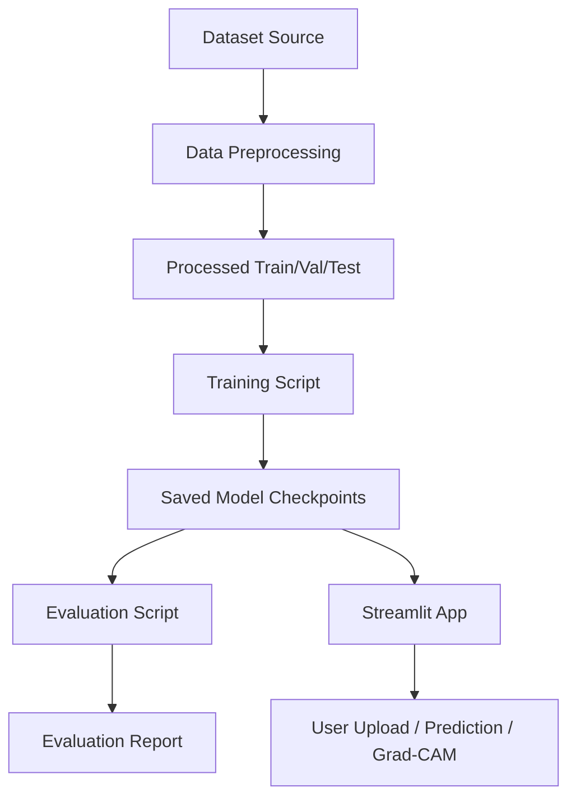

# AI-Powered Manufacturing Defect Detection System

## System Architecture

The system consists of three main layers:

1. Data Pipeline
   - Raw dataset ingestion
   - Image preprocessing, augmentation, and train/validation/test splitting
   - Structured folder layout for supervised learning

2. Model Training and Evaluation
   - Two deep learning backbones: ResNet50 and EfficientNet-B0
   - Transfer learning, fine-tuning, and performance comparison
   - Evaluation with accuracy, precision, recall, F1-score, and confusion matrix

3. Streamlit Web Application
   - Upload product images
   - Get defect/no-defect prediction
   - Predict specific defect category
   - Show confidence score and Grad-CAM explainability

## Component Workflow

## Data Flow

- `data/raw/mvtec/` contains original image folders.
- `src/data/preprocessing.py` processes raw images into `data/processed/`.
- `src/train.py` builds dataloaders and trains models.
- `src/evaluate.py` computes metrics and confusion matrices.
- `src/app.py` runs the web application with explainable outputs.
